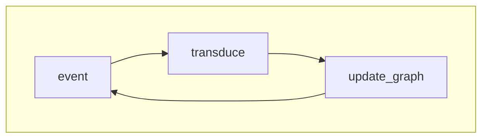

# Semantic Filesystem Abstraction

The Semantic File System is an advanced file management tool that enriches traditional file systems with semantic capabilities. It enables powerful querying and virtual directory creation by establishing relationships, tags, and metadata across files. With features like an extensible daemon and recursive directory monitoring, the system allows for seamless and customizable data organization. Users can further enhance functionality by developing transducers in C, making the system highly modular and adaptable to diverse workflows.

## Customizability and Modularity

The semantic file system is designed with extensibility in mind, allowing users to tailor its behavior to their specific needs. The core daemon provides hooks and an interface for integrating new functionalities. You can leverage these to create and register custom transducers, written in C or C++, that transform or interpret file data based on specific criteria.

#### Modularity

The system is modular by design, so you can load and unload transducers dynamically without interrupting the core daemon. This architecture ensures that the file system remains performant and flexible, even as new modules are added.
